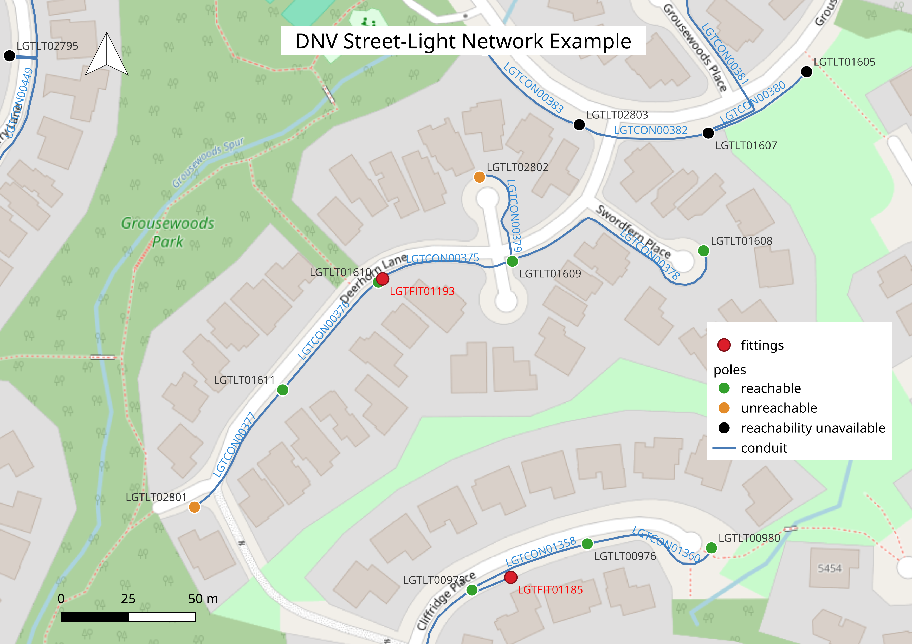
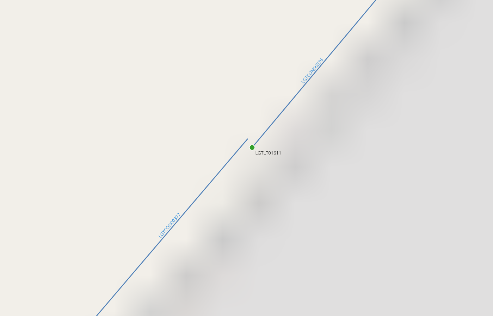

# Municipal Streetlight Network

This project uses public data from Vancouver and the District
of North Vancouver (DNV) to show how I acquire, inspect, normalize, QA, and
trace municipal infrastructure while documenting what the source data cannot
support.

```text
Municipal sources → ingest → inspect → normalize → QA → graph → trace → QGIS
```

## How it addresses the requirements

| Requirement | This repository |
| --- | --- |
| Acquire municipal street-light data | Source inventory and reproducible downloads for Vancouver and DNV |
| Normalize incoming data | YAML mappings, reusable GeoPandas normalizer |
| Build a repeatable import script | `scripts/normalize_dnv.py` and `scripts/normalize_vancouver.py` use the same package logic |
| Work with GIS formats and CRS | Vancouver GeoJSON/EPSG:4326; DNV FGDB/EPSG:26910; GeoPackage and KML inspection |
| Perform network tracing | NetworkX conduit graph and DNV network trace output |
| Use QGIS and produce exhibits | Manual QGIS filtering, labels, layouts, and map exports |
| Assess data quality honestly | QA summary, trace findings, assumptions, and limitations |
| Prepare an inventory handoff | Documented field-level handoff suitable for a later inventory system |

## Features

1. Acquire the municipality's current source files and document original sources.
2. Add or revise a YAML mapping after inspecting fields, geometry, and CRS.
3. Run the shared normalizer and produce a cleaned pole inventory.
4. Run QA and return counts, missing data, and ambiguous records.
5. Trace networks where source connectivity supports it.
6. Produce QGIS exhibits for technical and municipal review.

Adding another municipality should be primarily a configuration and source-
inspection task.

## Current evidence

- DNV: 5,474 poles, 4,641 conduit features, and 1,576 fittings normalized in
  EPSG:26910; 446 source networks traced.
- Vancouver: 57,984 poles normalized and QA-checked in EPSG:4326;
  tracing intentionally stops because the datasets lack a shared
  connectivity identifier.
- DNV fitting comments support only a subset of service-box or service-panel
  classifications; uncertain wording remains flagged.

## Assumptions and limits

`Network_Id` is used as an exploratory grouping signal, then checked against
conduit geometry. Exact endpoint matching is conservative and exposes small
positional gaps; no arbitrary snapping or automatic gap repair is applied.
Conduit geometry does not prove energized service. The public data does not
provide the panel ratings, circuit loads, conductor information, or spare
capacity required for a real capacity summary, so electrical capacity is not
inferred.

## Map exhibits

The overview exhibit shows how a municipal reviewer can inspect a candidate
network in QGIS: poles are classified by trace reachability, fittings are
separate from poles, and conduit IDs remain visible for follow-up. It is a
visual check of the normalized inventory and network interpretation.



The close-up map reveals something that is not obvious at first glance:
`LGTLT02801` is classified as unreachable even though it appears to be
connected to the network. When we zoom in, we find a slight 0.0486 m gap
between `LGTLT01611` and `LGTCON00377`. We show this finding for review and
keep the original data unchanged.



## Reproduce

```bash
python scripts/normalize_dnv.py
python scripts/normalize_vancouver.py
python scripts/run_qa.py
python scripts/run_trace.py
```

## Application materials

- [Case study](docs/application-case-study.md)
- [Source inventory](docs/data-sources.md)
- [Limitations](docs/limitations.md)
- [Network model](docs/network-model.md)
